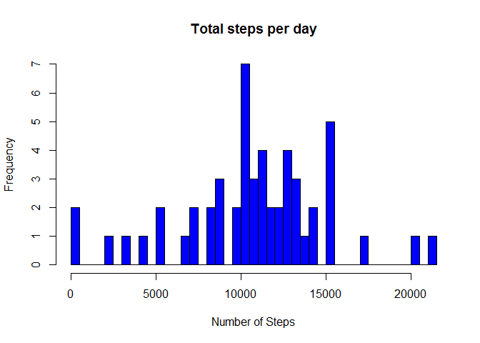
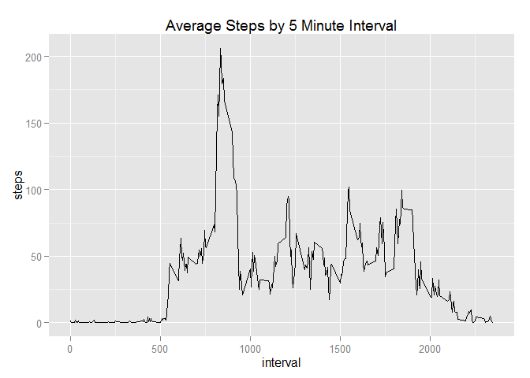
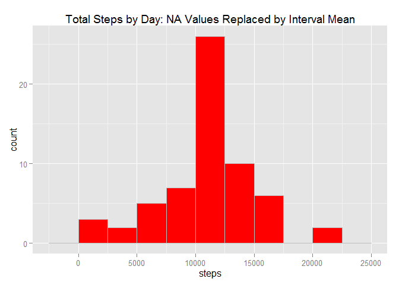
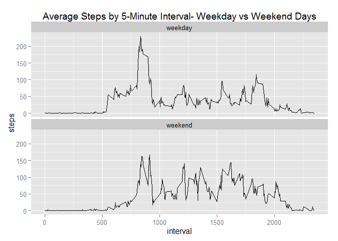

# Reproducible Research: Peer Assessment 1

```r
list.of.packages <- c("dplyr", "ggplot2", "knitr")
new.packages <- list.of.packages[!(list.of.packages %in% installed.packages()[,"Package"])]
if(length(new.packages)>0) {install.packages(new.packages)} 
require(dplyr)
```

```
## Loading required package: dplyr
## 
## Attaching package: 'dplyr'
## 
## The following objects are masked from 'package:stats':
## 
##     filter, lag
## 
## The following objects are masked from 'package:base':
## 
##     intersect, setdiff, setequal, union
```

```r
require(ggplot2)
```

```
## Loading required package: ggplot2
```

```r
require(knitr)
```

```
## Loading required package: knitr
```

```r
setwd("G://Documents//GitHub//RepData_PeerAssessment1")
```
## Loading and preprocessing the data

```r
unzip("activity.zip")
rawactivities<-read.csv("activity.csv")
rawactivities$date<-as.Date(rawactivities$date)
```

## What is mean total number of steps taken per day?
For this part of the assignment, you can ignore the missing values in the dataset.

```r
activities<-na.omit(rawactivities)
```
Calculate the total number of steps taken per day

```r
stepsperday <- aggregate(steps ~ date, data = activities, FUN = sum)
```
Make a histogram of the total number of steps taken each day

```r
hist(stepsperday$steps, breaks=50,col="blue", xlab="Number of Steps", main="Total steps per day")
```

 

Calculate and report the mean and median of the total number of steps taken per day

```r
mean(stepsperday$steps, na.rm = TRUE)
```

```
## [1] 10766.19
```

```r
median(stepsperday$steps, na.rm = TRUE)
```

```
## [1] 10765
```

## What is the average daily activity pattern?
Make a time series plot (i.e. type = "l") of the 5-minute interval (x-axis) and the average number of steps taken, averaged across all days (y-axis)

```r
averages<-aggregate(steps ~ interval, data = activities, FUN = mean)
ggplot(averages, aes(x=interval, y = steps)) + geom_line(stat = "identity") + ggtitle("Average Steps by 5 Minute Interval")
```

 

Which 5-minute interval, on average across all the days in the dataset, contains the maximum number of steps?

```r
averages[max(averages$steps),]
```

```
##     interval    steps
## 206     1705 56.30189
```
## Imputing missing values

There are many days/intervals where there are missing values (coded as NA). The presence of missing days may introduce bias into some calculations or summaries of the data.

Calculate and report the total number of missing values in the dataset (i.e. the total number of rows with NAs)

```r
sum(is.na(rawactivities))
```

```
## [1] 2304
```
Devise a strategy for filling in all of the missing values in the dataset. The strategy does not need to be sophisticated. For example, you could use the mean/median for that day, or the mean for that 5-minute interval, etc.

Create a new dataset that is equal to the original dataset but with the missing data filled in.

```r
dfsteps<-data.frame(rawactivities$steps)

dfsteps[is.na(dfsteps),]<-tapply(X=rawactivities$steps,INDEX=rawactivities$interval,FUN=mean,na.rm=TRUE)

filledactivities <- cbind(dfsteps, rawactivities[,2:3])
colnames(filledactivities) <- c("steps", "date", "interval")
```

Make a histogram of the total number of steps taken each day 

```r
stepsperdayfilled <- aggregate(steps ~ date, data=filledactivities, FUN=sum)

stepsfilledhist <- ggplot(stepsperdayfilled, aes(x=steps)) +
    geom_histogram(binwidth=2500, colour="grey", fill="red")
stepsfilledhist + ggtitle("Total Steps by Day: NA Values Replaced by Interval Mean")
```

 

Calculate and report the mean and median total number of steps taken per day. 

```r
mean(stepsperdayfilled$steps)
```

```
## [1] 10766.19
```

```r
median(stepsperdayfilled$steps)
```

```
## [1] 10766.19
```

Do these values differ from the estimates from the first part of the assignment? 


```r
mean(stepsperdayfilled$steps) - mean(stepsperday$steps) 
```

```
## [1] 0
```

```r
median(stepsperdayfilled$steps) - median(stepsperday$steps)
```

```
## [1] 1.188679
```

What is the impact of imputing missing data on the estimates of the total daily number of steps?

There is no difference in the mean, but the median has a difference of

```
## [1] 1.188679
```


## Are there differences in activity patterns between weekdays and weekends?

Create a new factor variable in the dataset with two levels - "weekday" and "weekend" indicating whether a given date is a weekday or weekend day.


```r
filledactivities$day[!weekdays(filledactivities$date, abbr = TRUE) %in% c("Sat", "Sun")] <-"weekday"
filledactivities$day[weekdays(filledactivities$date, abbr = TRUE) %in% c("Sat", "Sun")] <-"weekend"
```

Make a panel plot containing a time series plot (i.e. type = "l") of the 5-minute interval (x-axis) and the average number of steps taken, averaged across all weekday days or weekend days (y-axis). 


```r
stepsbyinterval<-aggregate(steps ~ interval + day, data=filledactivities, FUN=mean)
stepsbyintervalplot <- ggplot(stepsbyinterval, aes(x=interval, y=steps, group=1)) + geom_line() +
    facet_wrap(~ day, ncol=1)
stepsbyintervalplot + ggtitle("Average Steps by 5-Minute Interval- Weekday vs Weekend Days")
```

 

